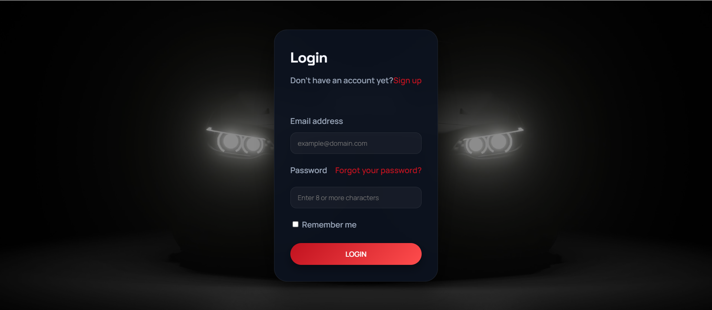

# Makina

A full-stack vehicle rental web app for browsing cars and motorcycles, managing user accounts, and completing secure checkout payments.

## Preview

## Tech Stack

## What This Project Includes

- Car and motorcycle listing pages with filtering and pagination
- Registration/login flow with email verification and session handling
- Shopping cart and Stripe-based checkout flow
- Admin/profile management features
- Docker setup for app, database, and phpMyAdmin
